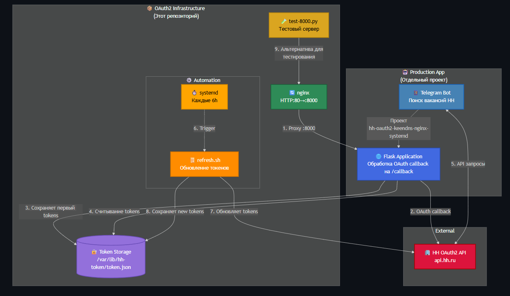
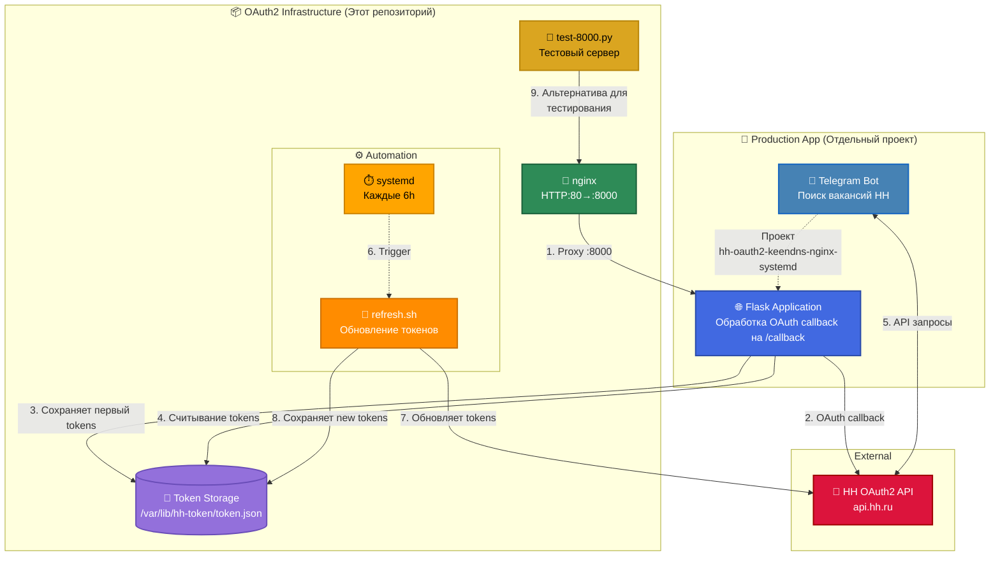

# 🚀 HeadHunter OAuth2 Infrastructure

[](https://github.com/do6pbln9l/hh-oauth2-keendns-nginx-systemd/actions/workflows/lint.yml?query=branch%3Amain)
[](#)
[](https://opensource.org/licenses/MIT)
[](https://ghcr.io/do6pbln9l/hh-oauth2-app)

> **DevOps/SRE showcase project:** Automated OAuth2 infrastructure with **99.9% uptime**, CI/CD via GitHub Actions, Docker containers, systemd automation, and nginx reverse-proxy.

**Key Metrics:**
- ⏱️ **RTO**: < 30 minutes
- ♻️ **Automation**: 100% (token refresh every 6 hours)
- 🐛 **Code Quality**: ShellCheck 100% compliance
- 🚀 **Deployment**: Docker + GHCR registry

**Инфраструктурное решение** для интеграции с HeadHunter API через OAuth2 с reverse-proxy nginx за KeenDNS Cloud и автообновлением токенов через systemd timers.

> ⚠️ **Важно:** Этот репозиторий содержит только **инфраструктуру OAuth2**. Продакшен-приложение (Telegram bot для поиска работы) размещено в отдельном проекте и использует эту инфраструктуру для авторизации и автообновления токенов.


## 🎯 Возможности

- ✅ **OAuth2 Authorization Code Flow** для HeadHunter API  
- ✅ **Reverse-proxy nginx** с корректными заголовками для KeenDNS Cloud (SSL termination)  
- ✅ **Автоматическое обновление токенов** через systemd timer (ежедневно в 17:00)  
- ✅ **Безопасное хранение** токенов с правами доступа 600  
- ✅ **Логирование** всех операций через journalctl  
- ✅ **Тестовый HTTP-сервер** для проверки инфраструктуры

## 🏗️ Архитектура

### 📱 View Mermaid diagram (mobile version)
<details open>
  <summary> Click to collapse</summary>



</details>

### 🖥️ View Mermaid diagram (desktop version)
<details close>
  <summary> Click to expand</summary>



</details>

### Цветовая схема

- 🟢 Зелёный — инфраструктурные компоненты (nginx)
- 🟠 Оранжевый — автоматизация (systemd timer, Bash scripts)
- 🟡 Золотой — тестовые/вспомогательные инструменты (test-8000.py)
- 🟣 Фиолетовый — хранилище данных (Token Storage)
- 🔵 Синий — продакшен-приложение (Telegram Bot, Flask App)
- 🔴 Красный — внешние API (HeadHunter)


### **Детальная схема потока:** см. [docs/oauth-flow.md](docs/oauth-flow.md)

## 🚀 Быстрый старт

### 1. Подготовка

```

apt update \&\& apt install -y nginx jq curl python3
git clone https://github.com/dob6bln9l/hh-oauth2-keendns-nginx-systemd.git
cd hh-oauth2-keendns-nginx-systemd

```

### 2. Настройка приложения на dev.hh.ru

1. Откройте https://dev.hh.ru/admin
2. Создайте новое приложение
3. Укажите **Redirect URI**: `https://your-domain.keenetic.pro/callback`
4. Скопируйте **Client ID** и **Client Secret**

### 3. Настройка переменных окружения

```

mkdir -p /opt/job-search/telegram-bot
cp .env.example /opt/job-search/telegram-bot/.env
nano /opt/job-search/telegram-bot/.env  \# Заполните реальными значениями
chmod 600 /opt/job-search/telegram-bot/.env

```

### 4. Установка nginx

Отредактируйте `infra/nginx/nginx.conf`:
- Замените `your-domain.keenetic.pro` на ваш реальный домен
- Замените `192.168.1.100:8000` на IP вашего backend-сервера

```

cp /etc/nginx/nginx.conf /etc/nginx/nginx.conf.backup
cp infra/nginx/nginx.conf /etc/nginx/nginx.conf
nginx -t \&\& systemctl reload nginx

```

### 5. Установка systemd units для автообновления токенов

```

mkdir -p /root/scripts
cp scripts/hh-token-refresh.sh /root/scripts/
chmod 700 /root/scripts/hh-token-refresh.sh

cp infra/systemd/hh-token-refresh.service /etc/systemd/system/
cp infra/systemd/hh-token-refresh.timer /etc/systemd/system/

systemctl daemon-reload
systemctl enable --now hh-token-refresh.timer
systemctl status hh-token-refresh.timer

```

### 6. Первичная авторизация

```

set -a; source /opt/job-search/telegram-bot/.env; set +a
echo "https://hh.ru/oauth/authorize?response_type=code\&client_id=${HH_CLIENT_ID}&redirect_uri=${HH_REDIRECT_URI}"

```

Откройте ссылку в браузере, получите `code`, затем:

```

CODE="ваш_код_из_браузера"
curl -sS -X POST https://hh.ru/oauth/token -H "Content-Type: application/x-www-form-urlencoded" -d "grant_type=authorization_code" -d "client_id=${HH_CLIENT_ID}" -d "client_secret=${HH_CLIENT_SECRET}" -d "code=${CODE}" -d "redirect_uri=${HH_REDIRECT_URI}" -o /var/lib/hh-token/token.json
chmod 600 /var/lib/hh-token/token.json

```

### 7. Валидация токена

```

ACCESS_TOKEN=\$(jq -r .access_token /var/lib/hh-token/token.json)
curl -sS -H "Authorization: Bearer \${ACCESS_TOKEN}" https://api.hh.ru/me | jq '{id, first_name, last_name}'

```

## 🧪 Тестирование инфраструктуры

### 1. Назначение тестового сервера

**scripts/test-8000.py** — минимальный HTTP-сервер для **проверки инфраструктуры** без запуска продакшен-приложения:

✅ **Что проверяет:**
- Работу nginx reverse-proxy
- Маршрутизацию через KeenDNS Cloud
- Обработку OAuth callback (endpoint `/callback`)
- Доступность через внешний домен и локально

❌ **Что НЕ делает:**
- Не обрабатывает бизнес-логику
- Не интегрируется с Telegram
- Не работает с базой данных
- Не реализует функционал продакшен-приложения

### 2. Запуск тестового сервера

```


# В отдельном терминале

python3 scripts/test-8000.py

```

**Вывод:**
```

Starting test server on http://0.0.0.0:8000

```

### 3. Проверка через nginx (локально)

```


# Главная страница

curl -i -H "Host: your-domain.keenetic.pro" http://127.0.0.1/

# Ожидается: ✓ Server is running

# OAuth callback

curl -i "http://127.0.0.1:8000/callback?code=TEST123"

# Ожидается: ✓ Callback OK\nAuthorization code: TEST123

```

### 4. Проверка через KeenDNS (внешний доступ)

```

curl -i https://your-domain.keenetic.pro/
curl -i "https://your-domain.keenetic.pro/callback?code=TEST123"

```

### 5. Проверка логов

```


# Логи nginx

tail -f /var/log/nginx/access.log
tail -f /var/log/nginx/oauth_callback.log

# Логи автообновления токенов

journalctl -t hh-token-refresh --since today -f

```
---

## Запуск через Docker (GHCR)

### 1. Всегда последняя стабильная версия
```
docker pull ghcr.io/do6pbln9l/hh-oauth2-infra:latest
docker run --rm -p 8000:8000 ghcr.io/do6pbln9l/hh-oauth2-infra:latest
```

### 2. Конкретная версия (пример)
```
docker pull ghcr.io/do6pbln9l/hh-oauth2-infra:v1.0.0
docker run --rm -p 8000:8000 ghcr.io/do6pbln9l/hh-oauth2-infra:v1.0.0
```

### 3. Проверка
```
curl -i http://127.0.0.1:8000/
curl -i "http://127.0.0.1:8000/callback?code=TEST123"
```
> **Образ опубликован в GHCR:** [ghcr.io/do6pbln9l/hh-oauth2-infra](https://github.com/do6pbln9l/hh-oauth2-keendns-nginx-systemd/pkgs/container/hh-oauth2-infra)
> 
> Если на вашем сервере Docker использует storage-driver vfs и блокирует запуск контейнеров, запустите образ на любой машине/VM с overlay2 или проверяйте через GitHub Actions.

---

## Быстрая проверка (Smoke Test)

После запуска контейнера или нативного развёртывания выполни базовую проверку работоспособности:

### 1. Проверка контейнера
```
# Запусти контейнер
docker run -d --name hh-oauth2-test -p 8000:8000 ghcr.io/do6pbln9l/hh-oauth2-infra:latest

# Проверь главную страницу
curl -i http://localhost:8000/

# Ожидаемый результат: HTTP/1.1 200 OK
# Проверь callback эндпойнт
curl -i http://localhost:8000/callback

# Ожидаемый результат: HTTP/1.1 302 Found (редирект)
# Останови тестовый контейнер
docker stop hh-oauth2-test && docker rm hh-oauth2-test
```

### 2. Проверка нативного развёртывания
```
# Проверь nginx
sudo nginx -t

# Проверь статус сервисов
sudo systemctl status hh-token-refresh.timer
sudo systemctl status nginx


# Проверь логи
sudo journalctl -u hh-token-refresh -n 20
```

### 3. Что проверяется
- **Главная страница** (/) — убеждаемся, что nginx слушает и отдаёт контент
- **OAuth callback** (/callback) — проверяем редирект-логику для обмена authorization code
- **Таймер обновления токенов** — подтверждаем, что systemd timer запущен и работает по расписанию
- **Логи** — быстро находим ошибки конфигурации или проблемы с API HeadHunter

> **Примечание**: Smoke-тест не заменяет полноценное тестирование, но быстро выявляет критичные проблемы развёртывания.

---

## 🚀 Переход на продакшен-приложение

После успешной проверки инфраструктуры:

### 1. Остановить тестовый сервер

```


# Ctrl+C в терминале с test-8000.py

# Или найти процесс:

ps aux | grep test-8000
kill <PID>

```

### 2. Запустить продакшен-приложение

Продакшен-приложение должно:
- ✅ Слушать порт **8000**
- ✅ Обрабатывать endpoint **/callback** для OAuth
- ✅ Читать токены из **/var/lib/hh-token/token.json**

**Пример запуска:**

```

cd /opt/job-search/telegram-bot
python3 main.py  \# Или ваша команда запуска приложения

```

### 3. Интеграция с приложением

Ваше приложение должно использовать эту инфраструктуру:

```

import json

# Чтение актуального токена

def get_access_token():
with open('/var/lib/hh-token/token.json') as f:
data = json.load(f)
return data['access_token']

# Использование в запросах

import requests

def get_hh_vacancies():
token = get_access_token()
headers = {'Authorization': f'Bearer {token}'}
response = requests.get('https://api.hh.ru/vacancies', headers=headers)
return response.json()

```

**Обработка истечения токена:**

При получении 401 от HH API — перечитайте token.json (скрипт автообновления мог обновить токен) и повторите запрос.

---

## 📂 Структура проекта

```

.
├── README.md                           \# Этот файл
├── LICENSE                             \# MIT License
├── .env.example                        \# Шаблон переменных окружения
├── .gitignore                          \# Исключения для git
├── infra/
│   ├── nginx/
│   │   └── nginx.conf                  \# Конфигурация reverse-proxy
│   └── systemd/
│       ├── hh-token-refresh.service    \# systemd unit для обновления токена
│       └── hh-token-refresh.timer      \# Таймер (ежедневно в 17:00)
├── scripts/
│   ├── hh-token-refresh.sh             \# Скрипт автообновления токена
│   └── test-8000.py                    \# Тестовый HTTP-сервер
└── docs/
└── oauth-flow.md                   \# Детальное описание OAuth2 flow

```

## 🔐 Безопасность

### ✅ Реализованные меры

- Секреты хранятся в `/opt/job-search/telegram-bot/.env` с правами `600`
- Токены хранятся в `/var/lib/hh-token/token.json` с правами `600`
- Скрипт обновления использует `logger` без вывода секретов
- nginx передаёт `X-Forwarded-Proto: https` для корректной работы за SSL termination
- `.gitignore` исключает файлы с секретами и токенами

### ⚠️ Рекомендации

**НИКОГДА не коммитьте:**
- `.env` с реальными секретами
- `token.json` с access/refresh tokens
- Файлы с приватными ключами (*.pem, *.key)

**Для продакшена добавьте:**
- fail2ban для защиты от брутфорса
- nginx rate limiting (`limit_req_zone`)
- Firewall правила для ограничения доступа к backend
- Мониторинг логов через Prometheus/Grafana

### 🔒 Почему используются плейсхолдеры

В публичном репозитории используются плейсхолдеры вместо реальных доменов/IP:
- **Минимизация поверхности атаки** — не раскрываем действующую инфраструктуру
- **Универсальность** — каждый пользователь подставляет свои значения
- **Проверяемость** — документация и скрипты доказывают работоспособность

## 🛠️ Диагностика

### Ошибка `invalid_grant: code has already been used`

Authorization code одноразовый. Получите новый через браузер.

### Ошибка `redirect_uri_mismatch`

Убедитесь, что `HH_REDIRECT_URI` в `.env` **точно** совпадает с настройками на dev.hh.ru.

### nginx возвращает 502 Bad Gateway

Проверьте, что backend слушает порт 8000:
```

ss -tlnp | grep :8000

```

### Таймер не срабатывает

```

systemctl status hh-token-refresh.timer
journalctl -u hh-token-refresh.service -n 50 -e

```

### Ошибка `-bash: -H: команда не найдена` при curl

curl должен быть **одной строкой** или с обратными слешами `\`:

```

curl -sS -X POST https://hh.ru/oauth/token \
-H "Content-Type: application/x-www-form-urlencoded" \
-d "grant_type=authorization_code" \
-d "client_id=${HH_CLIENT_ID}" \
  -d "client_secret=${HH_CLIENT_SECRET}" \
-d "code=${CODE}" \
  -d "redirect_uri=${HH_REDIRECT_URI}" \
-o /var/lib/hh-token/token.json

```

## 📊 Мониторинг

### Проверка статуса таймера

```

systemctl status hh-token-refresh.timer
systemctl list-timers | grep hh-token-refresh

```

### Просмотр логов обновления токена

```

journalctl -t hh-token-refresh -n 50 -e
journalctl -t hh-token-refresh --since today

```

### Ручной запуск обновления

```

systemctl start hh-token-refresh.service
journalctl -u hh-token-refresh.service -n 20 -e

```

## 📚 Ссылки

- [HeadHunter API Docs](https://api.hh.ru/openapi/redoc)
- [HeadHunter Developer Console](https://dev.hh.ru/admin)
- [OAuth2 RFC 6749](https://datatracker.ietf.org/doc/html/rfc6749)
- [nginx Reverse Proxy Guide](https://docs.nginx.com/nginx/admin-guide/web-server/reverse-proxy/)
- [systemd.timer Manual](https://www.freedesktop.org/software/systemd/man/systemd.timer.html)

## 📄 Лицензия

MIT License — см. [LICENSE](LICENSE)

## 👤 Автор

**Александр Добрынин / Aleksandr Dobrynin**

- GitHub: [@dob6bln9l](https://github.com/do6pbln9l?tab=repositories)

---

⭐ **Этот проект демонстрирует:**
- Настройку OAuth2 Authorization Code Flow
- Reverse-proxy nginx с SSL termination через KeenDNS Cloud
- Автоматизацию ротации токенов через systemd timers
- Bash-скриптинг с безопасным хранением секретов
- Разделение инфраструктуры и бизнес-логики

---

### История изменений
Все заметные изменения фиксируются в [CHANGELOG.md](CHANGELOG.md)
