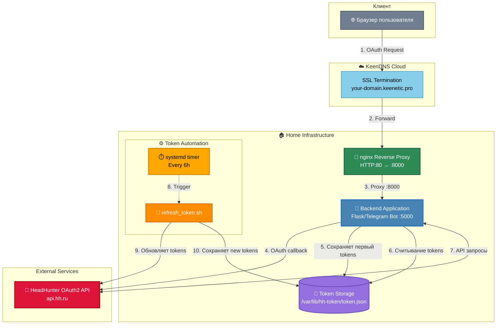

[← Back to README](../README.md)

### Цветовая схема

- 🟢 **Зелёный** — инфраструктурные компоненты (nginx)
- 🔵 **Синий** — приложения (Flask, Telegram Bot)
- 🔴 **Розовый** — внешние API (HeadHunter)
- 🟠 **Оранжевый** — автоматизация (systemd, Bash)
- 🟣 **Фиолетовый** — хранилище данных
- ⚪ **Серый** — клиентская часть
- 🔵 **Голубой** — облачные сервисы (KeenDNS)

---

### 📋 Пояснение к схеме

#### 1️⃣ Интернет (HTTPS:443)
**Описание:** Внешние пользователи обращаются к вашему домену через защищённое HTTPS-соединение.

**Особенности:**
- Порт: **443** (стандартный HTTPS)
- Протокол: SSL/TLS шифрование
- URL пример: `https://hh.your-domain.keenetic.pro/callback?code=AUTH_CODE`

---

#### 2️⃣ KeenDNS Cloud
**Описание:** Облачный сервис KeenDNS выполняет **SSL Termination** (расшифровка HTTPS) и **Port Forward** на локальный роутер.

**Функции:**
- **SSL Termination** — расшифровывает HTTPS-трафик
- **Port Forward** — перенаправляет HTTP:80 на nginx внутри вашей локальной сети
- Обеспечивает доступность сервиса из интернета без статического IP

**Поток:** HTTPS (443) → HTTP (80)

---

#### 3️⃣ nginx Reverse Proxy
**Описание:** Nginx принимает HTTP-запросы от KeenDNS и проксирует их на backend-приложение с дополнительными заголовками.

**Ключевые функции:**
- Добавляет заголовок **`X-Forwarded-Proto: https`** для корректной работы OAuth2 redirect
- Маршрутизирует трафик на порт **8000** (backend-приложение)
- Логирует OAuth callback запросы в `/var/log/nginx/oauth_callback.log`

**Конфигурация:** `infra/nginx/nginx.conf`

**Поток:** HTTP:80 → HTTP:8000

---

#### 4️⃣ Backend Application (OAuth Callback Handler)
**Описание:** Ваше продакшен-приложение (Telegram bot) обрабатывает OAuth callback и работает с HeadHunter API.

**Функции:**
- **OAuth Callback Handler** — принимает `authorization_code` на endpoint `/callback`
- Обменивает `code` на `access_token` и `refresh_token`
- Использует токены для запросов к HeadHunter API
- Отправляет результаты поиска вакансий в Telegram

**Технологии:**
- Python 3.x
- Flask/FastAPI (для обработки HTTP запросов)
- Telegram Bot API
- HeadHunter REST API

**Порт:** 8000 (локальный, недоступен из интернета напрямую)

**Расположение:** `/opt/job-search/telegram-bot/` (не включено в этот репозиторий)

---

#### 5️⃣ HeadHunter OAuth2 API
**Описание:** Официальный API HeadHunter для авторизации и получения данных о вакансиях.

**Endpoints:**
- **Authorize:** `https://hh.ru/oauth/authorize` — страница авторизации пользователя
- **Token:** `https://hh.ru/oauth/token` — обмен `code` на токены и обновление токенов
- **API:** `https://api.hh.ru/*` — получение данных о вакансиях, резюме и т.д.

**Документация:** https://dev.hh.ru/

---

### 🔄 Полный цикл OAuth2 авторизации

1. **Пользователь открывает ссылку:**

https://hh.ru/oauth/authorize?response_type=code\&client_id=YOUR_ID\&redirect_uri=https://hh.your-domain.keenetic.pro/callback

2. **HeadHunter показывает страницу авторизации** → пользователь подтверждает доступ

3. **HeadHunter редиректит на:**

https://hh.your-domain.keenetic.pro/callback?code=AUTHORIZATION_CODE

4. **Запрос проходит через:**
- Интернет (HTTPS:443)
- KeenDNS Cloud (SSL Termination → HTTP:80)
- nginx (добавляет X-Forwarded-Proto: https → HTTP:8000)
- Backend Application (принимает `code`)

5. **Backend обменивает `code` на токены:**

POST https://hh.ru/oauth/token
grant_type=authorization_code
code=AUTHORIZATION_CODE
client_id=YOUR_ID
client_secret=YOUR_SECRET

6. **HeadHunter возвращает:**

{
"access_token": "...",
"refresh_token": "...",
"expires_in": 1209600
}

7. **Токены сохраняются в `/var/lib/hh-token/token.json`**

8. **systemd timer автообновляет токен каждый день в 17:00** через скрипт `hh-token-refresh.sh`

---

### 🔐 Безопасность на каждом уровне

| Уровень | Меры безопасности |
|---------|-------------------|
| **Интернет → KeenDNS** | SSL/TLS шифрование (HTTPS) |
| **KeenDNS → nginx** | Локальная сеть, HTTP внутри периметра |
| **nginx → Backend** | Заголовок X-Forwarded-Proto для проверки |
| **Backend → HH API** | HTTPS + Client Secret для обмена токенов |
| **Хранение токенов** | Файл с правами `600` (только root) |
| **Логи** | Без вывода секретов (используется `logger`) |

---

